<toc-element></toc-element>

### Create a new project

Fire up the Spark editor and start a "JavaScript Web app using Polymer".

  <ul>
    <li>Click 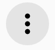 to start a new project.</li>
  </ul>
  

    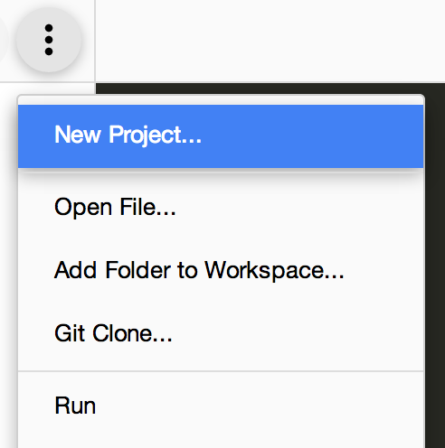
  

  <ul>
    <li>Enter "<em>PolymerMapsCodelab</em>" as the <b>Project name</b>.</li>
    <li>In the <b>Project type</b> dropdown, select "JavaScript Web app using Polymer".</li>
    <li>Click the <b>Create</b> button.</li>
  </ul>
  

    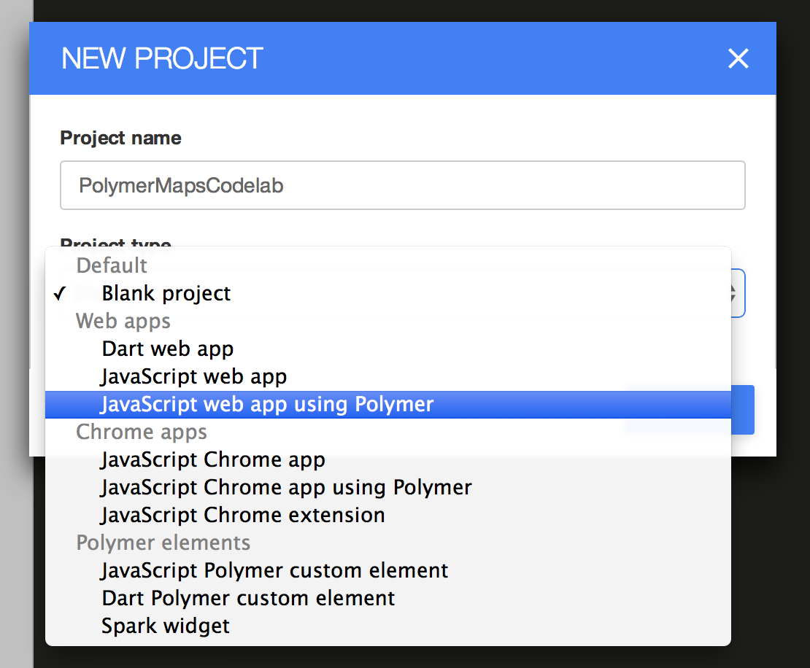
  

Spark creates a basic scaffold for your Polymer app. In the background, it also uses [Bower](http://bower.io/) to download and install a list of dependencies (including `polymer.js`) into the `bower_components/` folder. You'll learn more about using Bower in the next step.

    PolymerMapsCodelab/
      bower_components/ <!-- installed dependencies from Bower -->
      bower.json  <!-- Bower metadata file. Used for managing dependencies -->
      index.html  <!-- your app -->
      main.js
      styles.css

### Preview the app

At any point, hit the  button in the top toolbar to run the app. Spark fires up a web server and navigates to the `index.html` page. This is great way to preview changes as you make them.

<figure>
  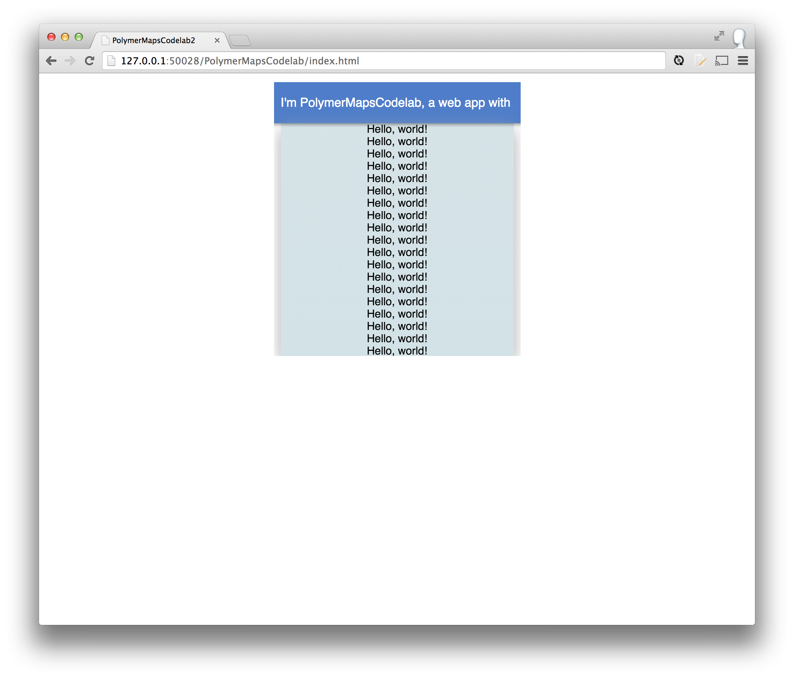
  <figcaption>Preview of index.html</figcaption>
</figure>

### Summary

In this step, you learned how to:

- Create a new Polymer application
- Run Spark's web server to preview the app

### Next up

At this point the app doesn't do much. Let's add a map!<toc-element></toc-element>

Polymer provides the `<google-map>` element ([github](https://github.com/PolymerLabs/google-map)) for rendering a Google Map.  To use it, you first need to install it using Bower.

<aside class="callout">
  <b>What is Bower?</b>
  
<a href="http://bower.io/">Bower</a> is a client-side package management tool that can be used with any web app. When working with Polymer, it simplifies the hassles of dependency management. Every component defines its own set of dependencies. When users install the component using Bower, its dependencies are installed alongside it under <code>bower_components/</code>.

</aside>

### Install the &lt;google-map> element

Normally, you'd run `bower install PolymerLabs/google-map --save` on the command-line to install `<google-map>`. However, Spark does not have a command-line for running Bower commands. Instead, you need to manually edit the `bower.json` to include `google-map`, then run Spark's "Bower Update" feature. "Bower Update" checks the dependencies in `bower.json` and installs any missing ones.

<!-- <aside class="callout">
  
<b>Pro tip</b>: the <code>--save</code> option appends the item to the <code>dependencies</code> section in <code>bower.json</code>.

</aside> -->

&rarr; Edit `bower.json` by adding `google-map` in the `dependenciess`:

    "dependencies": {
      "polymer": "Polymer/polymer#master",
      "core-elements": "Polymer/core-elements#master",
      "google-map": "PolymerLabs/google-map"
    }

  <ul>
    <li>Right-click the `bower.json` filename in the editor.</li>
    <li>Run <b>Bower Update</b> from the dropdown.</li>
  </ul>
  

    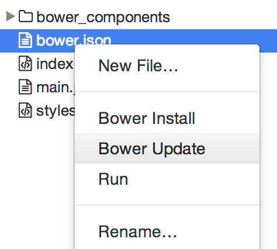
  

The download may take few seconds. You can verify that `<google-map>` (and any dependencies) were installed by checking that `bower_components/google-map/` was created and populated.

### Use the &lt;google-map> element

To employ `<google-map>`, you need to:

1. Use an HTML Import to load it in `index.html`.
2. Declare an instance of the element on the page.

&rarr; In `index.html`, add an [HTML Import](http://www.polymer-project.org/platform/html-imports.html) in the `<head>` that loads `google-map.html`. 

**Important**: all imports need to come after `platform.js` so the polyfill can properly load them.

    <head>
      ...
      
      <link rel="import" href="bower_components/google-map/google-map.html">
    </head>

&rarr; Remove the contents of `<body>` and declare a `<google-map>` element:

    <body>
      <google-map latitude="37.779" longitude="-122.3892" zoom="13"></google-map>
    </body>

As you can see, using `<google-map>` is completely declarative! The map is centered using the `latitude` and `longitude` attributes and its zoom level is set by the `zoom` attribute. 

#### Style the map

If you run the app right now, nothing will display. In order for the map to properly display itself, you need to set it to `display: block` and give it a `height` in CSS.

&rarr; Open `styles.css` and replace its contents with default styling:

    body, html {
      font-family: 'Roboto', Arial, sans-serif;
      height: 100%;
      margin: 0;
    }
    google-map {
      display: block;
      height: 100%;
    }

#### Add a marker

`<google-map>` supports markers by declaring `<google-map-marker>` elements as children.
The maker locations are also set using `latitude` and `longitude` attributes. 

&rarr; Back in `index.html`, add `<google-map-marker>` to the map:

    <google-map latitude="37.779" longitude="-122.3892" disableDefaultUI>
      <google-map-marker latitude="37.779" longitude="-122.3892"
                         title="Go Giants!" draggable="true"></google-map-marker>
    </google-map>

### Run the app

If you haven't already done so, hit the  button. At this point, you should see a map that takes up the entire viewport and a single pin.

<figure>
  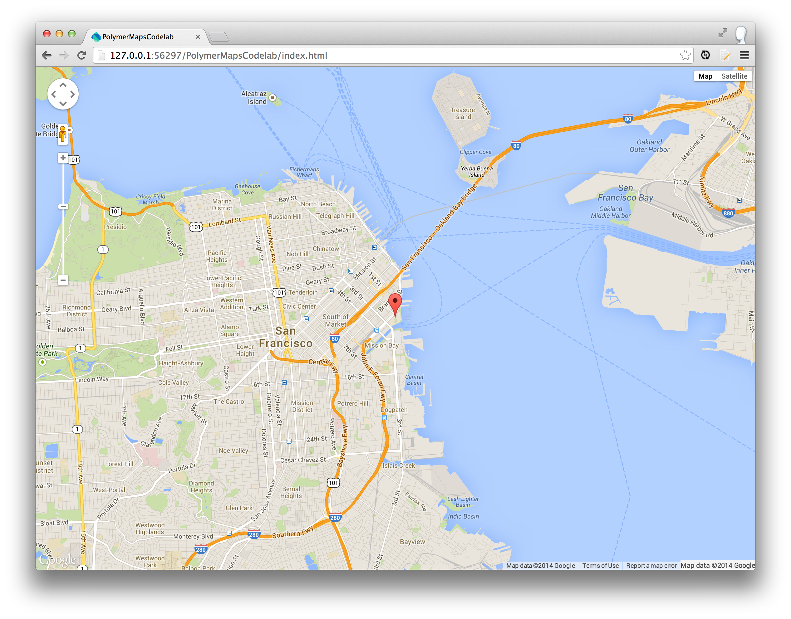
  <figcaption>index.html with the map and marker</figcaption>
</figure>

### Summary

In this step, you learned how to:

- Install the `<google-map>` element using Bower
-  Use the element and declaratively place a marker
- Style a custom element using CSS

### Next up

Add driving directions.
<toc-element></toc-element>

The `<google-map-directions>` element was installed with `<google-map>`. It provides driving direction information using the Google Maps API.

### Use the &lt;google-map-directions> element

To employ `<google-map-directions>`:

1. Use an HTML Import to load it in `index.html`.
2. Declare an instance of the element on the page.
3. "Connect" it to the map.

&rarr; In `index.html`, add an HTML Import for `google-map-directions.html`:

    <head>
      ...
      <link rel="import"
            href="bower_components/google-map/google-map-directions.html">
    </head>

&rarr; Declare `<google-map-directions>`. Set its `startAddress` attribute to "**San Francisco**" and the `endAddress` to "**Mountain View**".

    <body>
      <google-map latitude="37.779" longitude="-122.3892"></google-map>
      <google-map-directions startAddress="San Francisco"
                             endAddress="Mountain View">
      </google-map-directions>
    </body>

### Hook up directions to the map

`<google-map-directions>` fetches directions, but it isn't that useful by itself. You need to connect `<google-map-directions>` to `<google-map>` so the directions render on the map.

Both elements expose a `.map` property that allow users to access/set an underlying `Map` object (used by the Google Maps JavaScript API). To get these two elements talking, set them to use the same `Map` object. 

&rarr; In `index.html`, set the directions element to use the same `Map` object:

    

**Note**: Waiting until the map element fires its `api-load` event ensures that the map has been loaded.

<aside class="callout">
  <b>Wait...you said no code!</b>
  
OK, so there was a little JavaScript :) This step illustrated how you can configure an element using its events and properties. In the next step, you'll remove the code in favor of Polymer's declarative data binding features.

</aside>

### Run the app

Hit the  button! At this point, you should see the map, a marker, and added driving directions between **San Francisco** and **Mountain View**.

<figure>
  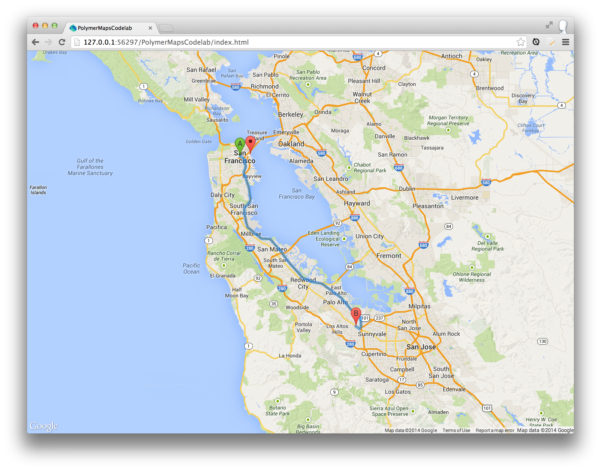
  <figcaption>Map with driving directions</figcaption>
</figure>

### Summary

In this step, you learned how to:

- Use `<google-map-directions>` to add driving directions to a amp
- "Connect" elements using their attributes sand properties.

### Next up

Learn Polymer's data-binding features and allow users to input their own start and end addresses.
<toc-element></toc-element>

Polymer supports [two-way data binding]((http://www.polymer-project.org/docs/polymer/databinding.html). A useful way to use data binding is to wire elements together using their attributes. This allows you to declaratively share data between components and is often more convenient than writing code.

### Add address inputs

Let's add input fields to allow users to input the start and end addresses. Polymer provides several elements for working with input fields: `core-field.html`, `core-icon.html`, and `core-icons.html`.

&rarr; In `index.html`, add three new HTML Imports for these components:

    <head>
      ...
      <link rel="import" href="bower_components/core-field/core-field.html">
      <link rel="import" href="bower_components/core-icon/core-icon.html">
      <link rel="import" href="bower_components/core-icons/core-icons.html">
    </head>

&rarr; In a container element with `id="inputs"`, declare two `<core-field>` elements:

    

      <core-field></core-field>
      <core-field></core-field>
    

`<core-field>` accepts an icon and an `<input>`.

&rarr; Add a `<core-icon>` and an `<input>` to each `<core-field>`. Set the `icon` attributes to "icons:search":

    

      <core-field>
        <core-icon icon="icons:search"></core-icon>
        <input placeholder="Start address" value="San Francisco">
      </core-field>
      <core-field>
        <core-icon icon="icons:search"></core-icon>
        <input placeholder="End address" value="Moutain View">
      </core-field>
    

&rarr; In `styles.css`, add default styling so the input container appears in the lower left corner:

    #inputs {
      position: absolute;
      bottom: 25px;
      left: 25px;
      z-index: 100;
    }

    core-field {
      background: #fff;
      border-radius: 3px;
      margin-top: 5px;
      width: 200px;
    }

    core-field core-icon {
      vertical-align: middle;
    }

<figure>
  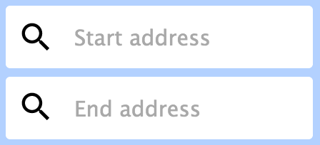
  <figcaption>Address inputs</figcaption>
</figure>

### Use data-binding outside of Polymer

Polymer's data-binding features are only available when creating a `<polymer-element>`. However, Polymer provides a [type-extension](http://www.html5rocks.com/en/tutorials/webcomponents/customelements/#typeextension) version of `<template>` named "auto-binding". It allows you to use `{{}}` bindings outside of an element.

Properties defined on an auto-binding template are two-way data-bound. For example:

    <template is="auto-binding">
      Hello, {{name}}. {{greeting}} <!-- Hello, Eric. How are you today? -->
    </template>

    

### Data-bind the map &#8596; directions element

In the last step, you wrote JavaScript to set the direction's `map` property:

    document.querySelector('google-map-directions').map = this.map;

Both maps and directions publish their `map` property as a [published property](http://www.polymer-project.org/docs/polymer/polymer.html#published-properties). This means you can use `{{}}` bindings on the `map` **attributes** to bind their `map` **properties** together.

<aside class="callout">
  <b>What are published properties?</b>
  
<a href="http://www.polymer-project.org/docs/polymer/polymer.html#published-properties">Published properties</a> allow users to configure a property using an HTML attribute of the same name. Instead of setting a property in JS (e.g. <code>myElement.foo = 'hi there'</code>), you can declare the attribute <code>&lt;my-element foo="hi there">&lt;/my-element></code>. Published properties are convenient to use because they support two-way data binding.

</aside> 

&rarr; In `index.html`, remove the `<script>` you added in the last step.

&rarr; Wrap the existing markup in `<template is="auto-binding">`.

&rarr; Bind the `map` attribute of `<google-map>` to the `map` attribute of `<google-map-directions>`. Make sure this is done inside `<template is="auto-binding">`:

    <template is="auto-binding">
      <google-map map="{{map}}" ...></google-map>
      <google-map-directions map="{{map}}" ...></google-map-directions>
    </template>

**Note**: We've used `{{map}}` as the binding property name, but you could easily use another name (e.g. `{{foo}}`).

### Data-bind the address inputs &#8596; directions element 

Right now, the `startAddress` and  `endAddress` attributes are hardcoded to "**San Francisco**" and "**Mountain View**", respectively. 

    <google-map-directions startAddress="San Francisco"
                           endAddress="Mountain View"></google-map-directions>

Likewise, the address inputs are hardcoded:

    <input placeholder="Start address" value="San Francisco">
    <input placeholder="End address" value="Moutain View">

We can make things more dynamic by binding these inputs to `<google-map-directions>`'s attributes.

&rarr; Bind the direction's `startAddress` and  `endAddress` attributes to the `value` of the appropriate input:

    <template is="auto-binding">
      <google-map map="{{map}}" ...></google-map>
      <google-map-directions map="{{map}}"
                             startAddress="{{start}}"
                             endAddress="{{end}}">
      </google-map-directions>

      ....

      <input placeholder="Start address" value="{{start}}">
      <input placeholder="End address" value="{{end}}">   
    </template> 

The name you use in each `{{}}` doesn't matter; as long as the binding names match for each pair of properties you want to bind together.

### Run the app

&rarr; Hit the  button.

&rarr; Enter "**CA**" for the start address.

&rarr; Enter "**NYC**" for the end address.

You should see the map update itself with driving directions between **California** to **New York**:

<figure>
  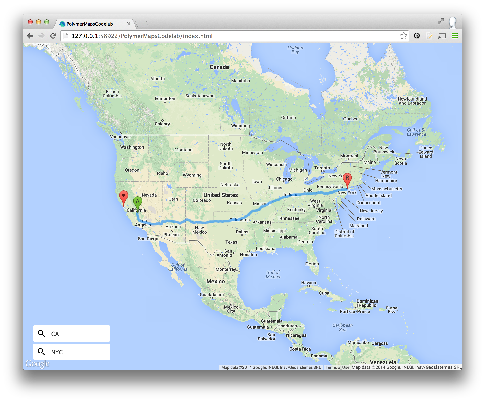
  <figcaption>Data-bound inputs powering the driving directions</figcaption>
</figure>

Try entering other destinations! If something goes wrong, check that your markup looks something like this:

    <body>

      <template is="auto-binding">

        <google-map map="{{map}}"
                    latitude="37.779" longitude="-122.3892"></google-map>
        <google-map-directions map="{{map}}"
                               startAddress="{{start}}"
                               endAddress="{{end}}">
        </google-map-directions>

        

          <core-field>
            <core-icon icon="icons:search"></core-icon>
            <input placeholder="Start address" value="{{start}}">
          </core-field>
          <core-field>
            <core-icon icon="icons:search"></core-icon>
            <input placeholder="End address" value="{{end}}">
          </core-field>
        

      </template>

    </body>

### Summary

Still no code!

In this step, you learned how to:

- Use the `<core-field>` and `<core-icon>` elements.
- Use use Polymer's two-way data binding features to bind to element attributes.
- Use data-binding outside of Polymer using `<template is="auto-binding">`.

### Next up

Allow users to select the type of directions (walking, transit, driving).
<toc-element></toc-element>

### Import the components for this setup:

&rarr; In `index.html`, add the following HTML Imports to the `<head>`:

    <link rel="import" href="bower_components/core-icons/iconsets/maps-icons.html">
    <link rel="import" href="bower_components/core-item/core-item.html">
    <link rel="import" href="bower_components/core-selector/core-selector.html">

`maps-icons.html` is required to load the [map iconset](http://www.polymer-project.org/components/core-icons/demo.html). You'll use it later to render icons for the travel modes.

### Use core-item and core-selector

[`<core-item>`](http://www.polymer-project.org/components/core-docs/index.html#core-item) is a simple line-item object that supports an icon and label. Its `icon` attribute takes the form `<iconset>:<name>`. For example, the following will place the "directions-car" icon from the "maps" icon set next to the text "DRIVING":

    <core-item icon="maps:directions-car" label="DRIVING"></core-item>

The `<google-map-directions>` element publishes a `travelMode` property for specifying the type of directions to render. It has four possible values: "DRIVING", "WALKING", "BICYCLING", and "TRANSIT".

[`<core-selector>`](http://www.polymer-project.org/components/core-docs/index.html#core-selector) is a general purpose component for selecting an item from a list. You'll use it to select a `<core-item>` travel mode for the directions.

&rarr; In the `
` container, add a `<core-selector>` with the travel mode options:

    

      ...
        <core-selector selected="0" layout horizontal>
          <core-item icon="maps:directions-car" label="DRIVING"></core-item>
          <core-item icon="maps:directionswalk" label="WALKING"></core-item>
          <core-item icon="maps:directions-bike" label="BICYCLING"></core-item>
          <core-item icon="maps:directions-transit" label="TRANSIT"></core-item>
       </core-selector>
    

**Notes**

- `layout` and `horizontal` are part of [Polymer's CSS layout system](https://github.com/Polymer/polymer/blob/master/layout.html). They provide flexbox support.
- `selected="0"` selects the first item, but you can specify a different default if necessary.

### Style the selector

By default, `<core-selector>` is not styled.

&rarr; In `styles.css`, add the following default styles for each element:

    core-selector {
      background: #eee;
      font-size: 12px;
      margin-top: 5px; 
    }

    core-item {
      padding: 3px 10px 3px 3px;
      cursor: pointer !important;
    }

    /* Note: <core-selector> applies the core-selected CSS class
             to the selected item. */
    core-item.core-selected {
      background: rgb(66, 133, 244);
      color: white;
      fill: white;
    }

<figure>
  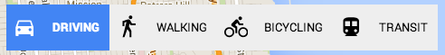
  <figcaption>Travel mode selector with styling</figcaption>
</figure>

### Data-bind the travel mode selector &#8596; directions element

The last thing you need to do is data-bind the `travelMode` attribute of `<google-map-directions>` to the `<core-selector>`'s `.selectedItem`. When a new item is chosen, `<core-selector>` updates this property to the item that was selected.

&rarr; Bind the direction's `travelMode` attribute to the selector's `.selectedItem`. Since `.selectedItem` returns a node, you need to bind `travelMode` to its `.label` property:

    <google-map-directions map="{{map}}"
                           startAddress="{{start}}" endAddress="{{end}}" 
                           travelMode="{{travelMode.label}}">
    </google-map-directions>

    ...

    <core-selector ... selectedItem="{{travelMode}}">
      ...
    </core-selector>

### Run the app

&rarr; Hit the  button.

&rarr; Enter "**SF**" for the start address.

&rarr; Enter "**Oakland**" for an end address.

&rarr; Click the different modes of travel.

The map should automatically update to show different forms of travel:

<figure>
  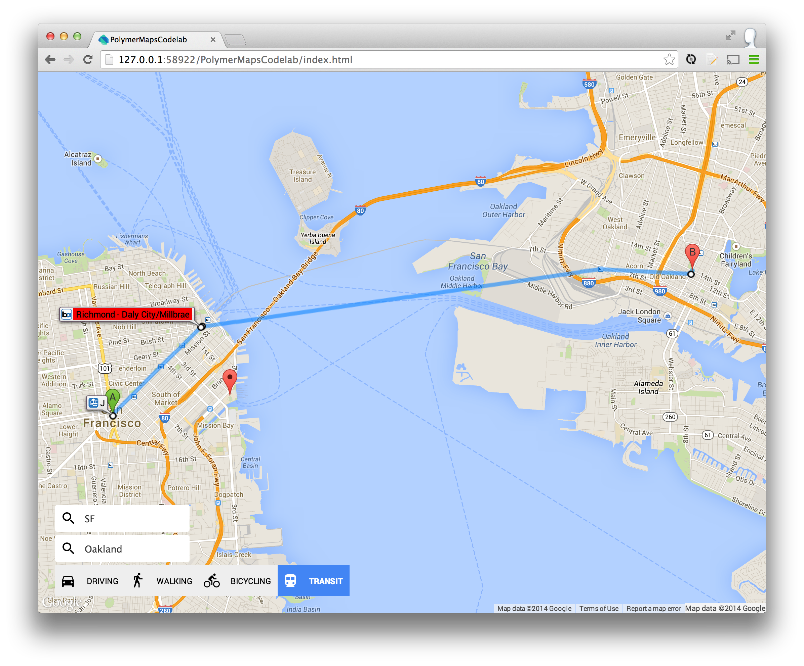
  <figcaption>Directions with travel mode selector</figcaption>
</figure>

### Summary

In this step, you learned how to:

- Use the `<core-selector>` and `<core-item>` elements.
- Use Polymer's icon set.
- Use use Polymer's two-way data-binding to set the travel mode.
### &lt;all-done>

You built an entire driving directions app without writing any code! 

Think about that for a second. This just goes to show you the power of web components. They're reusable and composable. Zest in Polymer's data-binding features and you can create an entire app using nothing but declarative markup.

### Additional resources

#### Polymer

- [polymer-project.org](http://ww.polymer-project.org)
- [Core element](http://www.polymer-project.org/components/core-docs/index.html) documentation
- [Polymer tag](http://stackoverflow.com/questions/tagged/polymer) on Stack Overflow

#### Other

- [Google Web Components](https://github.com/GoogleWebComponents)
- [webcomponents.org](http://ww.polymer-project.org)
